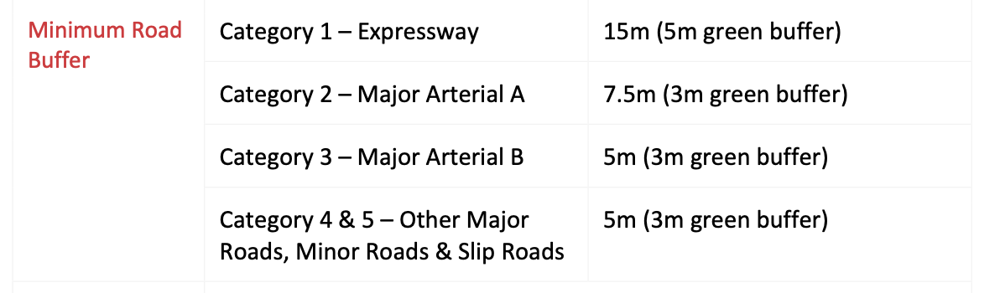

# RAG Chatbot for Singapore Urban Planning Documents

A Retrieval-Augmented Generation (RAG) system that answers questions about Singapore URA planning documents — grounded in official sources, with citations, and without model hallucination.



---

## Benefits of an RAG chatbot

Government planning documents are confidential, dense, scattered across PDFs, and hard to search. This project lets users ask natural-language questions and get answers that are:

- **Grounded** — answers come from a fixed, private document database, not the model's training data
- **Cited** — every answer links back to the exact source document/page for verification
- **Updatable** — the knowledge base can be refreshed anytime without retraining or fine-tuning any models

---

## Run the demo locally

```bash
# 1. Install Docker Desktop
# https://www.docker.com

# 2. Pull the image
docker pull alroychiang/singapore-planning-rag

# 3. Run it
docker run -p 8501:8501 --env-file .env alroychiang/singapore-planning-rag

# 4. Open in browser
http://localhost:8501
```

---

## Architecture

**Index pipeline** (one-time build):

```
┌─────────────┐   ┌────────────┐   ┌────────────┐   ┌──────────┐   ┌────────────┐
│  URA PDFs   │──▶│ extract.py │──▶│  embed.py  │──▶│ index.py │──▶│  Chroma DB │
│ (data/raw)  │   │            │   │            │   │          │   │(persistent)│
└─────────────┘   └────────────┘   └────────────┘   └──────────┘   └────────────┘
```

**Query pipeline** (per user question):

```
  User query
      │
      ▼
┌────────────┐        ┌────────────┐        ┌──────────────────────┐
│  query.py  │───────▶│  Chroma DB │───────▶│     generate.py      │
└────────────┘        └────────────┘        │                      │
                                            │  Ollama (qwen3:4b)   │
                                            │        or            │
                                            │     Gemini API       │
                                            └──────────┬───────────┘
                                                        │
                                                        ▼
                                          Grounded answer + citations
```

---

## Design decisions

| Component | Choice | Why |
|---|---|---|
| Vector DB | **ChromaDB** | Lightweight, free, easy to self-host. (Pinecone is enterprise-tier; Weaviate offers hybrid search but adds complexity not needed here) |
| Embedding model | **all-MiniLM-L6-v2** | Small, fast, reproducible across machines — right-sized for this project's scale |
| LLM backend | **Ollama (qwen3:4b)** or **Gemini API** | Ollama enables fully self-hosted inference for sensitive government documents — no data leaves the machine. Gemini available as a faster/cheaper alternative. Would consider **vLLM** if this needed to scale to many concurrent users |
| Chunking | **Custom script** (`extract.py`) | LangChain/LlamaIndex chunk by raw character count and handle tables poorly out of the box. Their advanced table-chunking tools are paid at scale |

**Hallucination guardrail:** if the answer isn't in the corpus, the model responds with *"I cannot find this information in the provided documents"* instead of guessing from its training data.

---

## Evaluation

`eval.py` runs the pipeline against a 15-question golden dataset (`queries.jsonl`) — hand-written queries with hand-picked ideal answer chunks. Re-run this any time the corpus, chunking, embedding model, vector DB, or LLM changes.

**Metrics used:**

| Metric | Formula | What it tells you |
|---|---|---|
| **Precision@k** | relevant chunks retrieved ÷ k | How much noise is in your results |
| **Recall@k** | relevant chunks retrieved ÷ total relevant chunks in golden set | Whether you're finding everything you should |
| **MRR** | 1 ÷ (rank of first relevant result) | How high up the first good result appears |

**Results (k=5):**

- **Precision@5: 0.25** — only 25% of retrieved chunks were relevant. Golden answers typically have just 1–2 ideal chunks, so precision naturally drops as k increases.
- **Recall@5: 0.806** — ~80% of all relevant chunks in the golden set were successfully retrieved.
- **MRR: 0.609** — the first relevant chunk appears, on average, at rank ~1.64.

---

## Guardrail example

**Q: "What is the maximum plot ratio for HDB residential estates?"**

The model found several *conditional* plot ratios (1.6, 1.4, 1.4 depending on GPR conditions) but no single unconditional figure — so instead of guessing, it correctly returned:

> *"I cannot find this information in the provided documents."*

This shows the system holding the line even when partial matches look tempting — it won't state an answer it can't fully back with a citation.

---

## Known limitations

**1. Runaway rambling on hard queries**
When an answer is difficult to find, `qwen3` sometimes produces long, meandering output that's neither a clean refusal nor a real answer — increasing response time.
→ *Fix: cap output tokens, reduce `k`, or tighten the prompt.*

**2. Semantically diluted chunks**
Query: *"What is the definition of plot ratio in the Master Plan?"* returned a false refusal, even though the correct definition existed in the corpus (`MP25WrittenStatement_p5_para0`).
→ *Cause: that chunk was embedded alongside seven other definitions, diluting it into a generic "definitions" vector that cosine similarity failed to match.*
→ *Fix: chunk by numbered section instead of newline splits.*

**3. Table structure mismatches**
Query: *"Are bay windows counted toward GFA?"* failed, even though the answer existed in a table (`Summary_GFA_p0_t3_r4`).
→ *Cause: column-oriented table chunking misses headers when questions are asked row-wise.*

---

## Attribution

The corpus consists of publicly available planning documents from the **Singapore Urban Redevelopment Authority (URA)**, including the Master Plan Written Statement, Development Control Handbooks, and Urban Design Guidelines.

These documents are © Singapore Government and remain the property of URA. They are downloaded on demand via `download.sh` from URA's public website and are **not redistributed** as part of this repository — users must fetch them directly from source.

This project is a technical demonstration and is **not affiliated with or endorsed by URA**. For official planning guidance, refer to [www.ura.gov.sg](https://www.ura.gov.sg).
