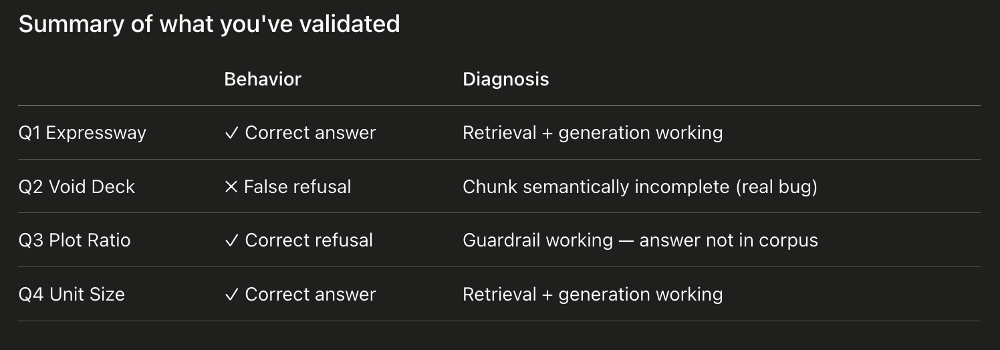
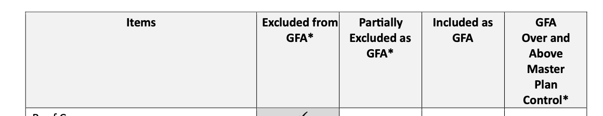
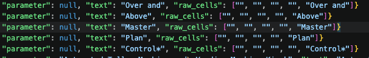

# Singapore Planning RAG

A RAG pipeline over URA (Urban Redevelopment Authority) planning documents.

## Setup

```bash
git clone https://github.com/alroychiang/singapore-planning-rag.git
cd singapore-planning-rag
./download.sh
```

If you hit a permission error, make the script executable first:

```bash
chmod +x download.sh
```

One Urban Design Guideline (Jurong Lake District) is included as a representative prose-style document. The pipeline handles it identically to the parameter-table Summaries; adding more area-specific guidelines is a corpus-expansion task, not a pipeline change."

Tested pypdf against both prose-heavy (Master Plan) and table-heavy (Summary handbooks) PDFs. Output quality was acceptable for both, so I kept the parser simple. If chunk quality issues surface during eval, pdfplumber is the natural upgrade."

Testing Tables in PDF if readable. Checkbox-matrix tables (e.g. Summary_GFA.pdf) don't extract cleanly with pypdf because column association is lost. For this corpus, I dropped that document and noted it as a known limitation. Production fix: pdfplumber for table-aware extraction, or layout-aware parsers like unstructured."

to install pdfplumber and re-try with downloaded documents

The corpus is parameter-table-heavy, so I built table-aware extraction with pdfplumber. Each table is preserved as a structured chunk rather than flattened into prose. Column associations stay intact, which is critical when retrieval is asked questions like 'is X included as GFA?'"

pypdf preserved column positions through whitespace, but cells weren't explicitly associated with columns — risky for LLM grounding. pdfplumber gives explicit cell-to-column mapping, with a known wrinkle: multi-line cells split into separate rows. I wrote a 5-line merge step to coalesce those. The result is table chunks where 'Roof Cover → Excluded from GFA' is unambiguous in the data, not inferred from whitespace


python -c "
import pdfplumber
with pdfplumber.open('data/raw/Summary-B1.pdf') as pdf:
    page = pdf.pages[0]
    tables = page.extract_tables()
    print(f'Found {len(tables)} table(s)')
    if tables:
        for row in tables[0][:15]:
            print(row)
"

it needs some data cleaning even after pdfplumber. pandas and what not. the standard remove empty values, forward fill ->

it becomes


Tables are the dominant content type in URA's planning summaries. I used pdfplumber for table-aware extraction, then a small normalization step: forward-fill the parameter column across wrap-around rows, drop empty phantom columns, filter empty rows. Each cleaned row becomes a chunk like 'Road Buffer | Category 1 – Expressway | 15m (5m green buffer)' — fully self-contained for retrieval. Bullet lists inside cells are preserved as \n• item strings, so the LLM still sees structured guidance, not flattened prose."

The original v1 had a "tables OR prose, never both" assumption that seemed reasonable until you tested it. You noticed real content was missing. The fix is principled (word-overlap filter, not a brittle regex hack). 

the pipeline extracts tables and prose from any planning document and filters duplicates by word-overlap. due to two functions in pdfplumber one for all text and one specifically for tables only. managed duplicate text extraction.

doing a script check for prose chunks and table chunks of script output

Every one of those terms (Downtown Core, CBD, City Hall, Bugis, Marina Centre, Nicoll) appears in the table cells. So the filter sees ~80% word overlap and drops it. The filter can't distinguish "intro paragraph describing topics covered by the table" from "garbled reconstruction of the table as text."

"Summary-BP_p0_t0_r1" chunk id means page 0, table 0 first row

picking between sentence transformers, openAI or voyage AI for embeddings

picked: sentence transformers. I used a local open-source embedding model so the pipeline is reproducible end-to-end. also my database is 20 documents only. Bigger documents will use OpenAI or voyageAI.

Loading model: all-MiniLM-L6-v2
Loaded 158 chunks
Embedding dimension: 384
chroma will face issues if you change models down the line E.g 768 for mpnet, 1024 for some larger ones

encoding="utf-8" because chunks contain "✓, – (em dash), ' (curly quote), é, &"

to check if my embeddings are normalized. (sentence transformers normalizes them by default) 1.0. we want to compare between vectors with just the "angles" between them E.g cosine similarity. removed magnitude from the picture. magnitude might skew the retrieval data.

Chroma stores your 842 vectors + their text + metadata in an indexed structure on disk side by side. At query time, it takes a query vector and returns the top-K nearest embedd-ed chunks (vectors) by similarity. Runs locally.

query prompt must be embedded with the same sentence-transformer as we did with database for chromaDB search.

without chroma, we have to manually load the embedding file, embedd user query, find the cosine similarity via dot product (assuming embedded database vector all normalized), top_k_indices = np.argsort(similarities)[-5:] take the last 5 most similar vectors' INDICES only. We use this index to retrieve the original human readble chunk via the indexes. risk of breaking., retreiving original chunk via index will break. if Chunks are re-ordered at all, retrieval fails.

without chroma we have to: 
chunks = [json.loads(line) for line in open("chunks.jsonl")]
for i in top_k_indices:
    print(chunks[i]["text"])           # the actual chunk content
    print(chunks[i]["source_file"])    # which PDF
    print(chunks[i]["page"])           # which page

Chroma stores the embedded-chunk, its index, its original text side by side
Chroma handles search.
Chroma allows adding of embedded-chunks (idk how)
Chroma retains speed at scale (1 million embedded chunks)

is scored in index.py? script? but indx doesnt do cosine similarity.?
Scored, filtered, with original text and metadata
Scored: cosine value similarity, K-nearest neighbours
Metadata: allows the first layer of search to sieve out the bulk of embedded data E.g Clarke Quay area. not required to search embedded data in other areas E.g Punggol
    - metadata (source_file, page, chunk_type, parameter)
    - anything filterable that isn't the vector or the main text

index.py
takes vectors + text chinks and input into Chromadb. metadata is added here.

Retrieval Augmented Generation
    - Augmented feeds chunks as context into another LLM as a grounded truth.
    - prevents LLM hallucination
    - verifyable with cited sources

query.py
loads one Chrome client's (directory) collection (collection name)
chroma's collection.query() only accepts Python's list not ndarray (vector/matrix)

test_questions = [
        "What is the maximum plot ratio for residential developments?",
        "Is a void deck included as GFA?",
        "What is the road buffer for an expressway?",
    ]
Summary handbooks dont have actual residential plot ratios. Only in Amendment Plan PDf. (to add in or add more relevant test questions)

Gemini API Key in .env: not in git, isolated to current project, survives on different shell sessions
Google AI Studio -> API key
Successfully installed google-auth-2.50.0 google-genai-1.47.0 pyasn1-0.6.3 pyasn1-modules-0.4.2
    - Prompting and receive responses (google-genai)
    - Authentical Protocols (google-auth)
    - working with google-auth, crytography translators (pyasn1 & pyasn1-modules)

client.models.generate_content() 
    — what I'm using: send a prompt, get a text response all in one go
    - user waits for a while before seeing a single text response
client.models.generate_content_stream() 
    — response shows as if (E.g a person typing in real time)
    - Good for long responses (user experience tweak)
    - dont have to wait for a while to see first text response appear
client.models.list()
    - lists all models available to your API key
client.files.upload() 
    — upload files (PDFs, images) to pass as context
client.chats.create() 
    — start a multi-turn conversation session
    - creates convo history automatically, creates a convo state
    - current implementation have no convo state
    - memory tracking

Correct Output:
========================================================================
Q: What is the road buffer for an expressway?
========================================================================

The road buffer for a Category 1 – Expressway is 15m, which includes a 5m green buffer [1, 2, 3, 4, 5].

Sources used:
  [1] Summary-Commercial.pdf, p0
      Road Buffer | Category 1 – Expressway | 15m (5m green)...
  [2] Summary-Hotel.pdf, p0
      Road Buffer | Category 1 – Expressway | 15m (5m green)...
  [3] Summary-BP.pdf, p0
      Road Buffer | Category 1 – Expressway | 15m (5m green buffer)...
  [4] Summary-CCI.pdf, p1
      Road Buffer | Category 1 – Expressway | 15m (5m green buffer)...
  [5] Summary-CCI.pdf, p5
      Road Buffer | Category 1 – Expressway | 15m (5m green buffer)...


Incorrect output:
========================================================================
Q: Is a void deck included as GFA?
========================================================================

I cannot find this information in the provided documents.

Sources used:
  [1] Summary_GFA.pdf, p2
      Void Deck | ✓...
  [2] Summary_GFA.pdf, p0
      GFA...
  [3] Summary_GFA.pdf, p0
      GFA*...
  [4] Summary_GFA.pdf, p1
      Items | GFA* | Above...
  [5] Summary_GFA.pdf, p2
      Items | GFA* | Above...

LLM doesnt know what column the '✓' is under Column header "Included as GFA" information lives in a table header
on a different chunk. Chunk is retrieval correct but semantically incomplete

More data cleaning. Instead of "Void Deck | ✓", emit "Void Deck → Included as GFA" at extraction time by mapping the column position to the header name under extract.py script.

notable correct rejection (guardrail) from Gemini 2.5 Augmentation:
========================================================================
Q: What is the maximum plot ratio for residential developments?
========================================================================

I cannot find this information in the provided documents.

Sources used:
  [1] Summary-Semi-Detached.pdf, p0
      Plot Size and Width (minimum) | Semi-Detached Houses (Side-to- side) Size: 200sqm Width: 8m | Semi-Detached Houses (Back-to- back) Size: 200sqm Width: 10m...
  [2] Summary-CCI.pdf, p0
      Gross Plot Ratio | Within Central Area and within other commercial centres, including party- wall developments such as in Geylang area | Subject to evaluation a...
  [3] Summary-EI.pdf, p0
      Gross Plot Ratio | Within Central Area and within other commercial centres, including party-wall developments such as in Geylang area | Subject to evaluation an...
  [4] Summary-PW.pdf, p0
      Gross Plot Ratio | Within Central Area and within other commercial centres, including party-wall developments such as in Geylang area | Subject to evaluation an...
  [5] Summary-CCI.pdf, p4
      Gross Plot Ratio & Storey Height | Subject to evaluation and localised urban design guidelines...

only provided plot size, minimum land dimensions required. Plot ratio: total floor area you're allowed to build divided by the land area. Correct answer text: "maximum gross plot ratio: 1.4". Correct answer only found in Amendment Plan. ACTUALLY it can be found in Summary-EI.pdf:

"Summary-EI.pdf", "page": 0, "chunk_type": "table_row", "parameter": "Gross Plot\nRatio", "text": "Gross Plot Ratio | Location | GPR", "raw_cells": ["Gross Plot\nRatio", "", "Location", "", "GPR"]}
{"chunk_id": "Summary-EI_p0_t0_r2", "source_file": "Summary-EI.pdf", "page": 0, "chunk_type": "table_row", "parameter": "Gross Plot\nRatio", "text": "Gross Plot Ratio | Within landed and low-density housing areas with GPR less than or equal to 1.4 | Up to 1.0", "raw_cells": ["Gross Plot\nRatio", "", "Within landed and low-density\nhousing areas with GPR less than\nor equal to 1.4", "", "Up to 1.0"]}
{"chunk_id": "Summary-EI_p0_t0_r3", "source_file": "Summary-EI.pdf", "page": 0, "chunk_type": "table_row", "parameter": "Gross Plot\nRatio", "text": "Gross Plot Ratio | At the fringe of landed and low- density housing areas with GPR less than or equal to 1.4", "raw_cells": ["Gross Plot\nRatio", "", "At the fringe of landed and low-\ndensity housing areas with GPR\nless than or equal to 1.4", "", ""]}
{"chunk_id": "Summary-EI_p0_t0_r4", "source_file": "Summary-EI.pdf", "page": 0, "chunk_type": "table_row", "parameter": "Gross Plot\nRatio", "text": "Gross Plot Ratio | Within HDB estates and in areas with GPR more than 1.4 | Up to 1.4", "raw_cells": ["Gross Plot\nRatio", "", "Within HDB estates and in areas\nwith GPR more than 1.4", "", "Up to 1.4"]}
{"chunk_id": "Summary-EI_p0_t0_r5", "source_file": "Summary-EI.pdf", "page": 0, "chunk_type": "table_row", "parameter": "Gross Plot\nRatio", "text": "Gross Plot Ratio | Within or at the fringe of industrial estates", "raw_cells": ["Gross Plot\nRatio", "", "Within or at the fringe of\nindustrial estates", "", ""]}

this chunk was only retrieved. No numerical information
{"chunk_id": "Summary-EI_p0_t0_r6", "source_file": "Summary-EI.pdf", "page": 0, "chunk_type": "table_row", "parameter": "Gross Plot\nRatio", "text": "Gross Plot Ratio | Within Central Area and within other commercial centres, including party-wall developments such as in Geylang area | Subject to evaluation and localised urban design guidelines", "raw_cells": ["Gross Plot\nRatio", "", "Within Central Area and within\nother commercial centres,\nincluding party-wall\ndevelopments such as in\nGeylang area", "", "Subject to evaluation and\nlocalised urban design guidelines"]}

debugged and realized. RETRIEVAL issue. sentence transformer "all-MiniLM-L6-v2" did not connect "HDB estates" "low Density housing" to "Residential" keyword. Singapore specific associations are not strong in this tiny transformer data. Will try bigger K value, more chunks retrieved. k=15



3 out of 4 correct behaviors

How frontier labs handle table columns cell misalignment format issues:
they don't extract tables into text upfront. They use vision models that see the document as an image and reason over the layout natively. Vision models consume more tokens. Our version uses text extraction for retrieval, cheap. Considering a Hybrid model. If retrieved chunks include checkbox tables/ layout sensitive content, send original 1 page to vision model

For production consider: document AI service (AWS Textract, Google Document AI, Azure Document Intelligence) for extraction. These already handle tables, multi-column layouts, checkboxes — trained on enormous corpora. Document AI services cost $1–10 per 1,000 pages. 2–3x the tokens consumed for a vision model. Frontier models also cant solve table misalignments via text extraction approach. hence, neededing to provide quality answers to paying users, vision model is most effective (sans the x3 times the cost). Also Frontier models do not have a pre-built index, it uses what users uploads directly


Handling Q: What is the maximum plot ratio for residential developments? issue.
Answer found raw chunks. However query and generate did not manage to link residential to HDB and
low density housing area
Embedding model (sentence transformer) treats "Within Central Area and within other commercial centres" as more semantically similar to "residential developments" than "Within landed and low-density housing areas."
Answer: Consider OpenAI embedding model/ Voyage AI, Hybrid retrieval (lexical and semantic), Fine tune own
embedding model


Handling Q: Is a void deck included as GFA? issue (TODO) also find out what is the limit for Gemini 2.5 flash LLM generation
Trying to improve extract.py

headers like GFA Over and Above Master Plan Control* are stacked on different and invisible rows. our old code totally discards headers as data.
Old code does not have header to table cell data relation. Hence Augmentation did not generate required answer.
like:


checking new extract.py's chunks.jsonl if handles edge case: E.g Summary-EI.pdf where ALL EI Developments is a header.
why jsonl instead of json. jsonl makes it possible to be streamed and parsed line by line.
jsonl used for large datasets
json used for configuration files

Now need to measure chunking quality. if our chunking strategy is effective enough (from the ground up each phase has its own quality metrics)
For your project, a 15-query golden set is realistic. Build it in an afternoon... (thinking if i should try this) (shall stick to new extraction pipeline first)
Eval harness -> Docker + UI

Eval harness:
queries.jsonl
eval.py ()
eval_results/json (raw output)
eval_summary.md (human readable)

eval.py: runs 15 queries, retrieves all results, compares results against Ground Truth (hand picked golden set queries with correct chunks), 
computes statistics E.g Precision@k Recall@k MRR@k. saves the result for future comparision if a different transformer is used or a different vector DB is used.

Precision@k: 
Precision@5 = (relevant chunks in top 5) / k
chroma retrieved top 5 chunks (assuming k = 5). if 2 found relevant to query, 2/5 = 0.4 points of trustworthiness. relevant == chunk correspond to hand found Ground Truth.
measures amount of noise in retrieved
why does the pipeline pick up irrelevant chunks
why is this good to measure?: almost never the case that vector databases are the fault during debugging.
First, check how is your data extracted from raw sources into jsonl. (chunk quality)
Second, check if chunks are too big or too small (granularity)
Third, user phrasing prompt
Only then check embedding model and then vectorDB (last) (Chroma, Pinecone, Weaviate all use cosine similarity)
the /k is kinda useless... why do we use this metric when we have Recall@K already? do we rely on recall@k more when 
we have successfuly obtained a Golden Dataset? If our golden dataset have ALOT of ground truth chunks.

Recall@k: 
(relevant chunks in top 5) / (total relevant chunks in golden set)
coverage, able to find everything i should have
why is this good to measure?: 

MRR (Mean Reciprocal Rank):
on average, how far down the list was the first relevant result found?
Reciprocal Rank: 1/ index position E.g 1/3 == 0.33

Other evaluation harnesses (using LLM on texts not rankings):
Hit Rate@K
nDCG@K
Mean Average Precision (MAP)
Recall@K for K = corpus size
Generation-specific metrics
Faithfulness/Groundedness (hallucination check)
Answer relevance
contezt utilization

use evaluations when swapping chukning or embedding or retrieval. one at a time to measure what changed.

"What is the average cost of a condominium in Singapore?",
"Who is the current CEO of URA?",
"What is the plot ratio for my plot of land at 123 Sengkang Drive?"
all produced cant find info (which is what we want)

Streamlit is tailored for Python heavy projects. UI capability limited. Used mostly for demos & not production (no Flask, HTML, CSS, Javascript needed)

Facing alot of limitations for Gemini 2.5 Flash API usages. Trying ollama local LLM for generative step only.
Downloading ollama: ollama pull llama3.2:3b
it works with ollama. even better than Gemini imo.
seeing evaluation.py now.

Overall (scored queries only, n=12):
  Precision@5:  0.250
  Recall@5:     0.806
  Recall@10:    0.917
  MRR:          0.609

Run container in terminal:
docker run -p 8501:8501 --env-file .env singapore-planning-rag