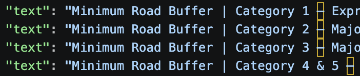

# Singapore Planning RAG

A RAG pipeline over URA (Urban Redevelopment Authority) planning documents.

## Setup

```bash
git clone https://github.com/alroychiang/singapore-planning-rag.git
cd singapore-planning-rag
./download.sh
```

If you hit a permission error, make the script executable first:

```bash
chmod +x download.sh
```

One Urban Design Guideline (Jurong Lake District) is included as a representative prose-style document. The pipeline handles it identically to the parameter-table Summaries; adding more area-specific guidelines is a corpus-expansion task, not a pipeline change."

Tested pypdf against both prose-heavy (Master Plan) and table-heavy (Summary handbooks) PDFs. Output quality was acceptable for both, so I kept the parser simple. If chunk quality issues surface during eval, pdfplumber is the natural upgrade."

Testing Tables in PDF if readable. Checkbox-matrix tables (e.g. Summary_GFA.pdf) don't extract cleanly with pypdf because column association is lost. For this corpus, I dropped that document and noted it as a known limitation. Production fix: pdfplumber for table-aware extraction, or layout-aware parsers like unstructured."

to install pdfplumber and re-try with downloaded documents

The corpus is parameter-table-heavy, so I built table-aware extraction with pdfplumber. Each table is preserved as a structured chunk rather than flattened into prose. Column associations stay intact, which is critical when retrieval is asked questions like 'is X included as GFA?'"

pypdf preserved column positions through whitespace, but cells weren't explicitly associated with columns — risky for LLM grounding. pdfplumber gives explicit cell-to-column mapping, with a known wrinkle: multi-line cells split into separate rows. I wrote a 5-line merge step to coalesce those. The result is table chunks where 'Roof Cover → Excluded from GFA' is unambiguous in the data, not inferred from whitespace


python -c "
import pdfplumber
with pdfplumber.open('data/raw/Summary-B1.pdf') as pdf:
    page = pdf.pages[0]
    tables = page.extract_tables()
    print(f'Found {len(tables)} table(s)')
    if tables:
        for row in tables[0][:15]:
            print(row)
"

it needs some data cleaning even after pdfplumber. pandas and what not. the standard remove empty values, forward fill ->

it becomes


Tables are the dominant content type in URA's planning summaries. I used pdfplumber for table-aware extraction, then a small normalization step: forward-fill the parameter column across wrap-around rows, drop empty phantom columns, filter empty rows. Each cleaned row becomes a chunk like 'Road Buffer | Category 1 – Expressway | 15m (5m green buffer)' — fully self-contained for retrieval. Bullet lists inside cells are preserved as \n• item strings, so the LLM still sees structured guidance, not flattened prose."

The original v1 had a "tables OR prose, never both" assumption that seemed reasonable until you tested it. You noticed real content was missing. The fix is principled (word-overlap filter, not a brittle regex hack). 

the pipeline extracts tables and prose from any planning document and filters duplicates by word-overlap. due to two functions in pdfplumber one for all text and one specifically for tables only. managed duplicate text extraction.

doing a script check for prose chunks and table chunks of script output

Every one of those terms (Downtown Core, CBD, City Hall, Bugis, Marina Centre, Nicoll) appears in the table cells. So the filter sees ~80% word overlap and drops it. The filter can't distinguish "intro paragraph describing topics covered by the table" from "garbled reconstruction of the table as text."

picking between sentence transformers, openAI or voyage AI for embeddings

picked: sentence transformers. I used a local open-source embedding model so the pipeline is reproducible end-to-end. also my database is 20 documents only. Bigger documents will use OpenAI or voyageAI.

Loading model: all-MiniLM-L6-v2
Loaded 158 chunks
Embedding dimension: 384
chroma will face issues if you change models down the line E.g 768 for mpnet, 1024 for some larger ones

encoding="utf-8" because chunks contain "✓, – (em dash), ' (curly quote), é, &"

to check if my embeddings are normalized. (sentence transformers normalizes them by default) 1.0. we want to compare between vectors with just the "angles" between them E.g cosine similarity. removed magnitude from the picture. magnitude might skew the retrieval data.

Chroma stores your 842 vectors + their text + metadata in an indexed structure on disk side by side. At query time, it takes a query vector and returns the top-K nearest embedd-ed chunks (vectors) by similarity. Runs locally.

query prompt must be embedded with the same sentence-transformer as we did with database for chromaDB search.

without chroma, we have to manually load the embedding file, embedd user query, find the cosine similarity via dot product (assuming embedded database vector all normalized), top_k_indices = np.argsort(similarities)[-5:] take the last 5 most similar vectors' INDICES only. We use this index to retrieve the original human readble chunk via the indexes. risk of breaking., retreiving original chunk via index will break. if Chunks are re-ordered at all, retrieval fails.

without chroma we have to: 
chunks = [json.loads(line) for line in open("chunks.jsonl")]
for i in top_k_indices:
    print(chunks[i]["text"])           # the actual chunk content
    print(chunks[i]["source_file"])    # which PDF
    print(chunks[i]["page"])           # which page

Chroma stores the embedded-chunk, its index, its original text side by side
Chroma handles search.
Chroma allows adding of embedded-chunks (idk how)
Chroma retains speed at scale (1 million embedded chunks)

is scored in index.py? script? but indx doesnt do cosine similarity.?
Scored, filtered, with original text and metadata
Scored: cosine value similarity, K-nearest neighbours
Metadata: allows the first layer of search to sieve out the bulk of embedded data E.g Clarke Quay area. not required to search embedded data in other areas E.g Punggol
    - metadata (source_file, page, chunk_type, parameter)
    - anything filterable that isn't the vector or the main text

index.py
takes vectors + text chinks and input into Chromadb. metadata is added here.

Retrieval Augmented Generation
    - Augmented feeds chunks as context into another LLM as a grounded truth.
    - prevents LLM hallucination
    - verifyable with cited sources

query.py
loads one Chrome client's (directory) collection (collection name)
chroma's collection.query() only accepts Python's list not ndarray (vector/matrix)

test_questions = [
        "What is the maximum plot ratio for residential developments?",
        "Is a void deck included as GFA?",
        "What is the road buffer for an expressway?",
    ]
Summary handbooks dont have actual residential plot ratios. Only in Amendment Plan PDf. (to add in or add more relevant test questions)

For